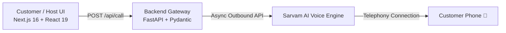

# 📞 VaaniBook

> **AI-Powered Voice Agent for Seamless Restaurant Reservations**

VaaniBook is a modern, full-stack application that bridges web reservations with conversational voice AI. By simply providing a guest's name and contact number, the system triggers an outbound phone call powered by **Sarvam AI Voice Agents**, conducting natural, human-like voice conversations to confirm bookings, answer restaurant FAQs, and manage table availability in real time.

---

## ✨ Features

- 🎙️ **Automated Outbound Voice Calling**: Instantly initiates realistic voice agent calls to customers via Sarvam AI Telephony.
- 🏢 **Dynamic Restaurant Context**: Injects restaurant details, operating hours, grace periods, dining duration, and cancellation policies directly into the agent's live prompt context.
- 📱 **Smart Phone Validation**: Built-in phone input sanitizer supporting standard and Indian (`+91`) number formatting.
- ⚡ **Real-Time Interactive Call States**: Visual stage transitions (`Form` → `Connecting` → `Calling` → `Active Call` → `Status / Retry`) with voice waveform animations.
- 🎨 **Modern Dark Aesthetics**: Crafted with Next.js 16, Tailwind CSS v4, Motion (Framer Motion), ambient radial lighting, and subtle grid patterns.
- 🐳 **Containerized & Production Ready**: Multi-container Docker Compose setup with automated container healthchecks and bridge networking.

---

## 🏗️ Architecture & Tech Stack



### **Frontend**
- **Framework**: [Next.js 16](https://nextjs.org/) (App Router) + [React 19](https://react.dev/)
- **Styling**: [Tailwind CSS v4](https://tailwindcss.com/)
- **Animations**: [Motion](https://motion.dev/) (Framer Motion)
- **Icons & Primitives**: [Lucide React](https://lucide.dev/), [Radix UI](https://www.radix-ui.com/)
- **Package Manager**: [pnpm](https://pnpm.io/)

### **Backend**
- **Framework**: [FastAPI](https://fastapi.tiangolo.com/) (Python >= 3.12)
- **Server**: [Uvicorn](https://www.uvicorn.org/)
- **Validation**: [Pydantic v2](https://docs.pydantic.dev/) & `pydantic-settings`
- **HTTP Client**: [HTTPX](https://www.python-httpx.org/) (Async)
- **Dependency Manager**: [uv](https://github.com/astral-sh/uv)

### **Telephony & Conversational AI**
- **Provider**: [Sarvam AI](https://www.sarvam.ai/) Outbounds API & Voice Agent Studio

---

## 📁 Repository Structure

```text
vaani_book/
├── docker-compose.yml           # Multi-container service definitions
├── backend/
│   ├── app/
│   │   ├── config.py            # Pydantic settings and environment loader
│   │   ├── routers/
│   │   │   └── call.py          # API route handler for triggering calls
│   │   └── services/
│   │       └── sarvam_outbound.py # Sarvam AI Outbound telephony client
│   ├── main.py                  # FastAPI application entrypoint & CORS config
│   ├── pyproject.toml           # Python dependencies and project metadata
│   ├── Dockerfile               # Backend Docker build specification
│   ├── .env.example             # Backend environment template
│   └── uv.lock
├── frontend/
│   ├── app/
│   │   ├── layout.tsx           # Global layout & metadata
│   │   ├── page.tsx             # Primary reservation booking page & state
│   │   └── globals.css          # Global CSS & Tailwind definitions
│   ├── components/
│   │   ├── agent/               # Agent status indicator & active call cards
│   │   ├── booking/             # Reservation form & telephone input controls
│   │   ├── branding/            # Brand logos and iconography
│   │   ├── magic/               # Waveform visualizers, border beam & grid
│   │   └── ui/                  # Reusable UI primitives
│   ├── package.json             # Frontend dependencies & npm scripts
│   ├── Dockerfile               # Frontend multi-stage Docker build
│   └── .env.example             # Frontend environment template
└── README.md
```

---

## ⚙️ Configuration & Environment Variables

### 1. Backend (`backend/.env`)

Copy `backend/.env.example` to `backend/.env` and supply your Sarvam AI credentials:

```bash
cp backend/.env.example backend/.env
```

| Variable | Description | Example |
| :--- | :--- | :--- |
| `SARVAM_API_KEY` | Sarvam AI Secret API Key | `sk_live_...` |
| `SARVAM_ORG_ID` | Organization ID in Sarvam dashboard | `org_xxxxxxxx` |
| `SARVAM_WORKSPACE_ID` | Workspace ID in Sarvam dashboard | `ws_xxxxxxxx` |
| `SARVAM_APP_ID` | Voice Agent App ID created in Sarvam | `app_xxxxxxxx` |
| `SARVAM_APP_VERSION`| Version of the voice agent app | `1` |
| `SARVAM_CONNECTION_ID`| Telephony Connection ID (rented phone number) | `conn_xxxxxxxx` |
| `SARVAM_AGENT_PHONE`| Phone number assigned to the voice agent | `+91XXXXXXXXXX` |

### 2. Frontend (`frontend/.env`)

Copy `frontend/.env.example` to `frontend/.env`:

```bash
cp frontend/.env.example frontend/.env
```

| Variable | Description | Default |
| :--- | :--- | :--- |
| `FRONTEND_PORT` | Port exposed by frontend service | `3002` |
| `BACKEND_PORT` | Port exposed by backend service | `8002` |
| `NEXT_PUBLIC_API_URL` | Base URL of the backend API | `http://localhost:8002` |

---

## 🚀 Getting Started

### Option A: Running with Docker Compose (Recommended)

Make sure Docker and Docker Compose are installed, then run:

```bash
# 1. Build and start both containers in detached mode
docker compose up --build -d

# 2. View streaming logs
docker compose logs -f

# 3. Check health status
docker compose ps
```

- **Frontend Application**: [http://localhost:3002](http://localhost:3002)
- **Backend API Docs**: [http://localhost:8002/docs](http://localhost:8002/docs)
- **Backend Healthcheck**: [http://localhost:8002/health](http://localhost:8002/health)

---

### Option B: Local Manual Setup

#### 1. Backend Setup

Prerequisite: Python 3.12+ (or [uv](https://github.com/astral-sh/uv))

```bash
cd backend

# Using uv (fastest):
uv venv
source .venv/bin/activate
uv pip install -r pyproject.toml

# Or using standard python venv:
python3 -m venv .venv
source .venv/bin/activate
pip install -e .

# Start the development server
python main.py
# Runs on http://localhost:8000
```

#### 2. Frontend Setup

Prerequisite: Node.js 20+ and [pnpm](https://pnpm.io/)

```bash
cd frontend

# Install dependencies
pnpm install

# Start development server
pnpm dev
# Runs on http://localhost:3000 (or specified port)
```

---

## 🔌 API Documentation

### **Trigger Outbound Reservation Call**
`POST /api/call`

Initiates an automated telephone call to the target customer.

#### Request Body
```json
{
  "customer_name": "Aditi Sharma",
  "phone_number": "+919876543210"
}
```

#### Successful Response (`200 OK`)
```json
{
  "status": "success",
  "customer_name": "Aditi Sharma",
  "data": {
    "call_id": "call_xxxxxxxxxxxxx",
    "status": "queued"
  }
}
```

#### Error Response (`400 Bad Request` or `500 Internal Server Error`)
```json
{
  "detail": "Sarvam AI credentials are not configured. Please set the required environment variables."
}
```

---

### **Health Check**
`GET /health`

Verifies that the backend API service is running.

```json
{
  "status": "ok"
}
```

---

## 🛡️ License

This project is licensed under the [MIT License](LICENSE).
